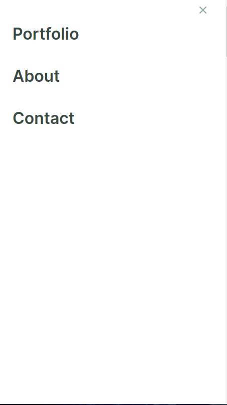

# Portfolio

> Creating my portfolio website to showcase my development skills

## Built With

- HTML
- CSS
- Linters
- Figma
- Javascript
- VS code

## Live Demo

For the link to the live demo, [Click here](https://ilynette.github.io/my-portfolio/)

Prerequisites

You only need a browser to run the html file.

## Authors

👤 **Author1**

- GitHub: [@iLynette](https://github.com/iLynette)
- Twitter: [@achola_lynette](https://twitter.com/acholah_lynette)
- LinkedIn: [Lynette Acholah](https://www.linkedin.com/in/lynette-acholah/)

👤 **Author2**

- GitHub: [@githubhandle](https://github.com/i-max-xi)
- LinkedIn: [LinkedIn](https://www.linkedin.com/in/appiah-maxwell-0212b41a1/)

👤 **Author3**
- GitHub: [@githubhandle](https://github.com/levy002)
- LinkedIn: [LinkedIn](https://www.linkedin.com/in/levy-ukwishaka-405391223)

## 🤝 Contributing

Contributions, issues, and feature requests are welcome!

Feel free to check the [issues page](../../issues/).

## Show your support

Give a ⭐️ if you like this project!

## Acknowledgments

- Hat tip to anyone whose code was used
- Inspiration
- etc

## 📝 License

This project is [MIT](./MIT.md) licensed.
